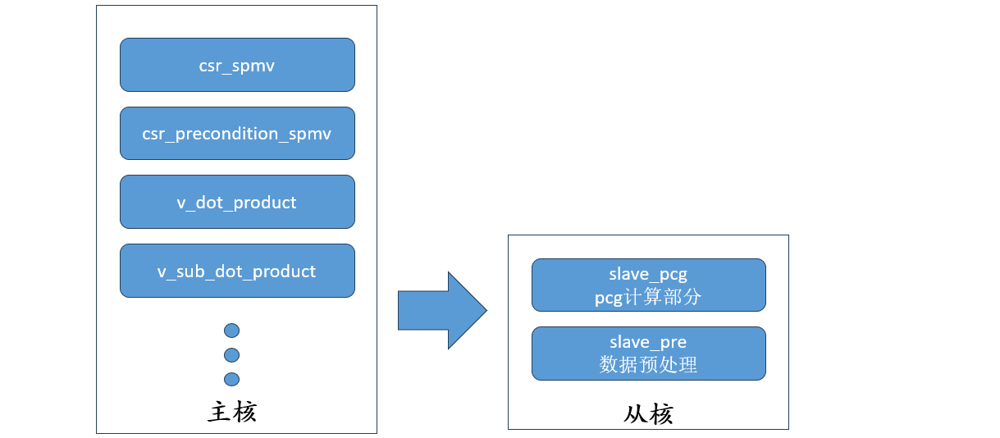
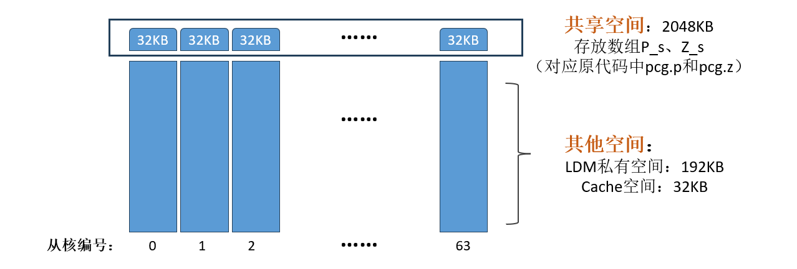
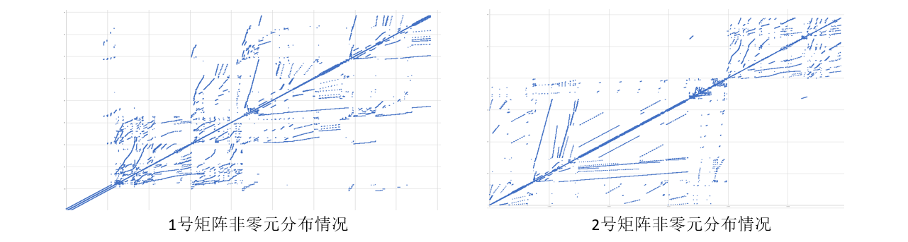
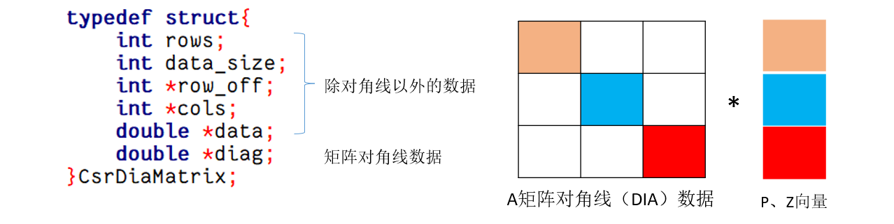
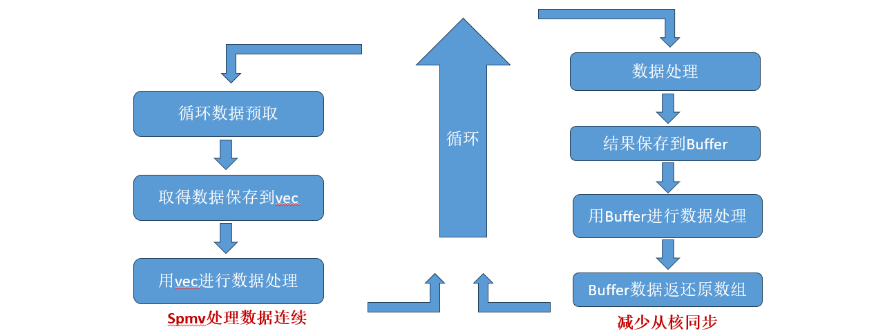

## 思路及问题

稀疏矩阵离散访存，采用CSR存储格式花费时间和空间较大。

矩阵非零元分布不均，导致负载不均衡

**优化思路：**修改稀疏矩阵的存储格式，采用共享内存，算子融合等

## 具体优化过程

### 1.算子融合

将原pcg计算部分的代码整合到一个函数中，使代码更加简洁和高效。

### 2.众核计算

将计算内容分配给64个从核，利用同步和规约的方式解决函数依赖的问题。

### 3.启用连续共享段

### 4.采用CSR-DIA存储格式

原代码是按照CSR代码进行存储，但我们经过对给定数据的分析，发现矩阵在对角线附近非零元素相对密集，因此可以采用CSR-DIA格式进行存储，做到对角线元素的连续访存。

先计算CSR-DIA格式中DIA部分的数据，再计算CSR部分，保证DIA计算部分数据访问的连续性。

### 5.数据预取优化

采用缓冲数组vec和Buffer对数据进行预取和暂存。

增加spmv处理数据的连续性，同时减少从核之间的同步次数。

## 性能优化过程记录表

| BKMs      | Description  | Comments                                                     | 矩阵1 time(ms) | 矩阵2 time(ms) | 矩阵3 time(ms) | time (ms) | speed up |
| --------- | ------------ | ------------------------------------------------------------ | -------------- | -------------- | -------------- | --------- | -------- |
| Baseline: | -O2          | 初始代码O2优化                                               | -              | -              | -              | 1283948.5 | 0.00%    |
| BKM #1    | 众核计算     | 在主核中开启从核，将计算任务分配到64个从核中，利用共享空间和规约/同步解决函数依赖 | -              | -              | -              | 82941.7   | 1548.01% |
| BKM #2    | 编译选项优化 | 开启-Ofast、-msimd、-funroll-all-loops、-mfma编译选项进行自动向量化、循环展开和乘加硬件优化 | -              | -              | -              | 57623.9   | 2228.15% |
| BKM #3    | 访存优化     | 采用CSR-DIA格式进行数据存储、利用数组预读等方法使得数据处理时尽量连续访问 | -              | -              | -              | 34271.8   | 3746.37% |
| BKM #4    | DMA优化      | 使用非阻塞方法进行DMA读取，可在数据处理时进行DMA传输         | -              | -              | -              | 29181.4   | 4399.89% |
| BKM #5    | 数组私有化   | 将一些可以直接存储在私有空间中的共享数组改为私有，减少处理时间 | 5178.9         | 6855.4         | 10828.6        | 22862.9   | 5615.86% |